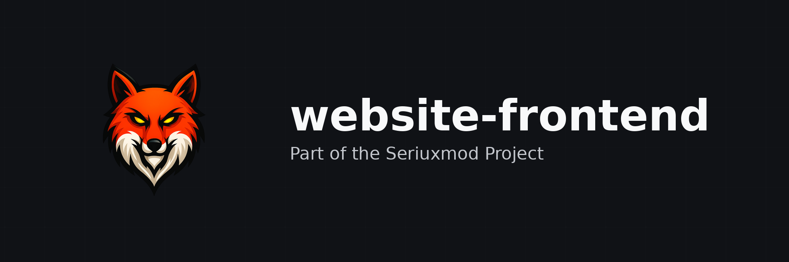

<p align="center">
  
</p>

# SeriuxMod Website Frontend

Dieses öffentliche Repository enthält die zentrale Weboberfläche von SeriuxMod. Die React-Anwendung verbindet Landingpage, öffentliche Spielerprofile, Forum, Community, Store, Systemstatus, Account-Sicherheit und den rollenbasierten Administrationsbereich in einer gemeinsamen Oberfläche.

## Funktionsbereiche

- Landingpage mit News-Slider und Launcher-Präsentation
- globale Spielersuche und 3D-Skinanzeige
- öffentliche SeriuxMod- und Minecraft-Profile
- Forum mit Boards, Themen, Beiträgen und Moderationsoberfläche
- Feedback-/Vorschlagsbereich und Social-Hub
- Store, Checkout, Käufe, Abrechnung und Shop-Administration
- OAuth2-Login, E-Mail-Verifikation, Passwort-Reset, Passkeys und Sitzungsverwaltung
- Systemstatus mit Serviceübersicht und Connection Flow
- Administration für Benutzer, Forum und Store

## Libraries und Versionen

| Library / Toolchain | Version | Verwendung |
| --- | --- | --- |
| React | `^18.3.1` | Komponenten und UI-State |
| React DOM | `^18.3.1` | Browser-Rendering |
| React Router DOM | `7.18.2` | clientseitiges Routing |
| React Icons | `^5.2.1` | Icons |
| skinview3d | `^3.4.1` | Minecraft-Skinmodell |
| Tailwind CSS | `^3.4.6` | Utility-CSS |
| PostCSS | `8.5.26` | CSS-Verarbeitung |
| Autoprefixer | `10.5.4` | Browser-Präfixe |
| Vite | `8.2.2` | Entwicklungsserver und Produktionsbuild |
| `@vitejs/plugin-react` | `6.1.0` | React-Integration für Vite |
| Prettier | `^3.3.3` | Formatierung |
| Prettier Tailwind Plugin | `^0.6.5` | Sortierung von Tailwind-Klassen |

Die exakten aufgelösten Versionen stehen in `package-lock.json`; die Tabelle bildet die direkten Angaben aus `package.json` ab.

## Lokale Entwicklung

Voraussetzung ist Node.js 22 oder neuer, passend zur GitHub-Pages-Pipeline.

```bash
npm ci
npm run dev
```

Produktionsbuild und lokale Vorschau:

```bash
npm run build
npm run preview
```

Mit `npm run format` werden die Dateien unter `src/` durch Prettier formatiert.

## Konfiguration

| Variable | Zweck |
| --- | --- |
| `VITE_PLAYER_DIRECTORY_API_URL` | Basis-URL der öffentlichen Player-Directory-/Skin-Quelle |

Weitere Service-URLs und OAuth2-Einstellungen werden derzeit in den Dateien unter `src/lib/` geführt. Neue Geheimnisse dürfen nicht als `VITE_*`-Variable eingebunden werden, weil Vite diese Werte in den Browser-Build schreibt.

## Projektstruktur

```text
src/components/       globale Navigation, Suche, Presence und wiederverwendbare UI
src/components/admin/ Layout und Bausteine des Admin-Dashboards
src/pages/            Seiten für Home, Forum, Community, Store, Account und Status
src/lib/              Authentifizierung und API-Clients
src/config/           öffentliche Frontend-Konfiguration
```

## Deployment

Ein Push auf `main` löst `.github/workflows/deploy.yml` aus. Die Pipeline installiert mit `npm ci`, erzeugt den Vite-Build und veröffentlicht die Website über GitHub Pages.

Da dieses Repository öffentlich ist, enthält diese README absichtlich keine interne Endpoint-, Payload- oder Berechtigungsdokumentation. Die Verträge der Backend-Services stehen in den jeweiligen privaten Service-Repositories.
